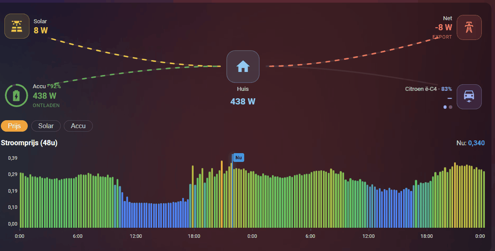

# Energy Flow & Price Card



*(Nederlands hieronder / Dutch below)*

A compact Lovelace card for Home Assistant that combines two things in one block:

- **Energy flow:** the home in the center, with solar, battery (incl. SoC ring), grid and EV charger(s) in the corners, and animated lines that only move when power is actually flowing.
- **Price & history charts:** switch between three tabs — a bar chart of your dynamic electricity price (Frank Energie, Tibber, Nord Pool, ENTSO-e, Zonneplan, and others), today's solar production, and today's battery SoC. The price chart has a "Now" marker and a customizable low/medium/high color scale.

Everything is configurable through the graphical editor in the HA GUI: pick your entities, toggle flow/charts on or off, add multiple cars with their own names, choose auto-scroll or a static view for several cars, set the price window (8-48 h), and adjust all colors and price thresholds. The card is **multilingual (NL / EN / DE)** and follows your Home Assistant language automatically, with a manual override in the editor.

## Installation via HACS (custom repository)

1. HACS -> top-right three dots -> **Custom repositories**.
2. Paste your repo URL (`https://github.com/dennisbest85/energy-flow-price-card`), type **Dashboard** (Lovelace), and add it.
3. Search for **Energy Flow & Price Card** in HACS and install.
4. Refresh your browser (or clear the cache).

HACS adds the resource automatically. Manual: Settings -> Dashboards -> (three dots) Resources -> `/hacsfiles/energy-flow-price-card/energy-flow-price-card.js`, type JavaScript Module.

## Usage

Add a card to a dashboard -> search for **Energy Flow & Price Card** -> fill in your entities in the editor. Or via YAML:

```yaml
type: custom:energy-flow-price-card
show_flow: true
show_price: true
display_zero: false          # true = empty branches (and idle car charger) stay visible
price_hours: 24              # 8 to 48
price_start: midnight        # "midnight" (from 00:00) or "now"
price_profile: default       # "default" | "zonneplan" | "tibber" | "frank"
price_relative_hours: false  # true = extra axis row counting hours from now ("now", 1, 2, 3…), Zonneplan-style
price_show_day_marker: false # true = thin line + "tomorrow" label where the axis crosses midnight
chart_auto_scroll: false     # true = cycle price -> solar -> battery tabs automatically
chart_scroll_interval: 8     # seconds between automatic tab switches
language: auto               # "auto" (follow HA) | nl | en | de
solar_power: sensor.solar_power
grid_power: sensor.p1_power                   # +/- : positive = import, negative = export
battery_charge_power: sensor.battery_charge   # W, positive
battery_discharge_power: sensor.battery_discharge # W, positive
battery_soc: sensor.battery_soc
price_entity: sensor.electricity_price        # any provider with a price in EUR/kWh
gas_price_entity: sensor.gas_price            # optional, shown next to the electricity price (€/m³)
cars:
  - name: My car
    power: sensor.wallbox_power               # node appears only while charging (or with display_zero)
    soc: sensor.car_soc                        # optional
# colors (optional)
color_solar: "#f5c518"
color_battery: "#4caf50"
color_grid: "#ff6b5e"
color_car: "#a78bfa"
color_home: "#7dd3fc"
# price color scale (optional): smooth gradient between points
price_stops:
  - { value: 0.0, color: "#3b82f6" }   # blue
  - { value: 0.2, color: "#3b82f6" }
  - { value: 0.25, color: "#22c55e" }  # green
  - { value: 0.35, color: "#eab308" }  # yellow
  - { value: 0.7, color: "#ef4444" }   # red
```

## Notes

- **Layout profiles:** `price_profile` swaps the price chart's style and colors to match a known provider's app: `default` (bar chart, fully customizable colors/thresholds via `price_stops`), `zonneplan` (bar chart with Zonneplan's green palette), `frank` (smooth single-color line, Frank Energie style), `tibber` (smooth line/area colored teal below and orange above today's average price, Tibber style). Pick it in the editor's **Layout** section — when a profile other than "Default" is selected, the manual price color scale is hidden because the profile's colors are fixed.
- **Relative hour row:** `price_relative_hours` (off by default) adds a second axis row under the price chart counting hours from now ("now", 1, 2, 3…) instead of clock times — handy for "in how many hours is it cheapest", like Zonneplan's app. Works with every layout profile.
- **New-day marker:** `price_show_day_marker` (off by default) draws a thin line with a small "tomorrow" label where the axis crosses midnight, like Zonneplan's app. Independent of the layout profile, works with all of them.
- **Auto-scroll chart tabs:** `chart_auto_scroll` (off by default) cycles automatically through the available chart tabs (price → solar → battery) with a smooth fade transition; `chart_scroll_interval` sets the seconds between switches (default 8). Clicking a tab manually still works and simply restarts the timer.
- **Gas price:** set `gas_price_entity` to also show the current gas price (with a small flame icon) next to the electricity price in the price chart's header — no separate chart, just a value next to "Now".
- **Cars:** add one or more via the editor, each with its own name. With multiple cars you can choose auto-scroll (cycles automatically) or a static view. A car node appears only while charging (`power` > 5 W), unless *display zero* is on.
- **Price:** works with any provider (Frank, Tibber, Nord Pool, ENTSO-e, Zonneplan...) as long as the value is in EUR/kWh. Window is adjustable from 8 to 48 hours, starting at midnight or now.
- **Battery:** two separate sensors (charge W and discharge W), both positive.
- **Home usage** is calculated automatically: `solar + grid + battery_discharge - battery_charge` (grid is +/-). No separate entity needed.
- **Solar / battery history** charts use the Home Assistant history API for today (from 00:00 to now); make sure the recorder tracks those entities.
- **Price data:** the card looks for an array attribute on the price entity (`prices`, `prices_today`, `today`, `raw_today`, `data`, and a few more) with fields like `from`/`start` and `price`/`value`. Frank Energie provides this by default. Chart not working? Check Developer Tools -> States to see which attribute your sensor uses.

---

# Energy Flow & Price Card (Nederlands)

Een compacte Lovelace-card voor Home Assistant die twee dingen in een blok combineert:

- **Energie-flow:** het huis centraal, met solar, accu (incl. SoC-ring), net en laadpaal/auto('s) in de hoeken, en bewegende lijnen die alleen lopen als er vermogen stroomt.
- **Prijs- en historie-grafieken:** wissel tussen drie tabbladen - een staafgrafiek van je dynamische stroomprijs (Frank Energie, Tibber, Nord Pool, ENTSO-e, Zonneplan e.a.), de zonne-opbrengst van vandaag, en het accu-SoC-verloop van vandaag. De prijsgrafiek heeft een "Nu"-markering en een instelbare kleurschaal goedkoop/gemiddeld/duur.

Alles is instelbaar via de grafische editor in de HA GUI: kies je entiteiten, zet flow/grafieken aan of uit, voeg meerdere auto's met eigen naam toe, kies auto-scroll of een statische weergave bij meerdere auto's, stel het prijsvenster in (8-48 u), en pas alle kleuren en prijsdrempels aan. De card is **meertalig (NL / EN / DE)** en volgt automatisch de taal van Home Assistant, met een handmatige keuze in de editor.

## Installatie via HACS (custom repository)

1. HACS -> rechtsboven de drie puntjes -> **Custom repositories**.
2. Plak de URL van je repo (`https://github.com/dennisbest85/energy-flow-price-card`), type **Dashboard** (Lovelace), en voeg toe.
3. Zoek **Energy Flow & Price Card** in HACS en installeer.
4. Ververs je browser (of leeg de cache).

De resource wordt door HACS automatisch toegevoegd. Handmatig kan ook: Instellingen -> Dashboards -> (drie puntjes) Resources -> `/hacsfiles/energy-flow-price-card/energy-flow-price-card.js`, type JavaScript Module.

## Gebruik

Voeg in een dashboard een card toe -> zoek **Energy Flow & Price Card** -> vul in de editor je entiteiten in. Of via YAML (zie het Engelse voorbeeld hierboven).

## Opmerkingen

- **Layout-profielen:** `price_profile` verandert de stijl en kleuren van de prijsgrafiek naar het voorbeeld van een bekende leverancier-app: `default` (staafgrafiek, kleuren/drempels volledig aanpasbaar via `price_stops`), `zonneplan` (staafgrafiek met het groene Zonneplan-palet), `frank` (vloeiende lijn in één kleur, stijl Frank Energie), `tibber` (vloeiende lijn/vlak, teal onder en oranje boven het gemiddelde van vandaag, stijl Tibber). Kies dit in de **Layout**-sectie van de editor — bij een ander profiel dan "Standaard" verdwijnt de handmatige prijs-kleurschaal, omdat de kleuren dan vastliggen.
- **Relatieve-uren-rij:** `price_relative_hours` (standaard uit) voegt een tweede as-rij onder de prijsgrafiek toe die uren vanaf nu telt ("nu", 1, 2, 3…) in plaats van kloktijden — handig om te zien over hoeveel uur het goedkoopst is, zoals in de Zonneplan-app. Werkt met elk layout-profiel.
- **Nieuwe-dag-lijntje:** `price_show_day_marker` (standaard uit) tekent een dun lijntje met een klein "morgen"-label waar de as middernacht kruist, zoals in de Zonneplan-app. Onafhankelijk van het layout-profiel, werkt met alle profielen.
- **Automatisch wisselen tussen grafiektabs:** `chart_auto_scroll` (standaard uit) wisselt automatisch tussen de beschikbare grafiektabs (prijs → solar → accu) met een vloeiende overgang; `chart_scroll_interval` stelt het aantal seconden tussen wissels in (standaard 8). Handmatig op een tab klikken blijft werken en herstart gewoon de timer.
- **Gasprijs:** stel `gas_price_entity` in om ook de actuele gasprijs (met een klein vlammetje-icoon) te tonen naast de stroomprijs in de header van de prijsgrafiek — geen aparte grafiek, gewoon een waarde naast "Nu".
- **Auto's:** voeg er een of meer toe via de editor, elk met een eigen naam. Bij meerdere auto's kies je auto-scroll (wisselt vanzelf) of een statische weergave. Een auto-node verschijnt alleen bij actief laden (`power` > 5 W), tenzij *display zero* aan staat.
- **Prijs:** werkt met elke leverancier (Frank, Tibber, Nord Pool, ENTSO-e, Zonneplan...) zolang de waarde in EUR/kWh is. Venster instelbaar van 8 tot 48 uur, startend om middernacht of nu.
- **Accu:** twee aparte sensoren (laden W en ontladen W), beide positief.
- **Huisverbruik** wordt automatisch berekend: `solar + net + accu_ontladen - accu_laden` (net is +/-). Geen aparte entiteit nodig.
- **Solar-/accu-historie** gebruikt de Home Assistant history API voor vandaag (00:00 tot nu); zorg dat de recorder die entiteiten bijhoudt.
- **Prijsdata:** de card zoekt in het prijs-entiteit naar een array-attribuut (`prices`, `prices_today`, `today`, `raw_today`, `data` e.a.) met velden als `from`/`start` en `price`/`value`. Frank Energie levert dit doorgaans. Werkt de grafiek niet? Kijk in Ontwikkelhulpmiddelen -> Statussen welke attribuutnaam jouw sensor gebruikt.
